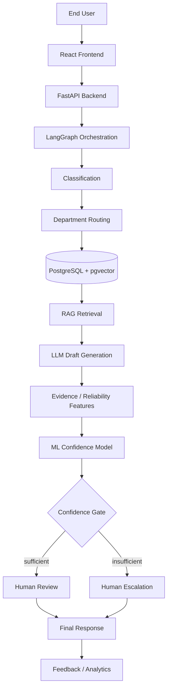

# TicketSense

**Multi-Agent Enterprise Ticket Routing & Resolution System**

TicketSense is an AI-assisted platform for routing and resolving enterprise support
tickets. A ticket (text, optionally with an attachment such as an image, PDF, or log) is
classified, routed to the right department, and matched against a department-scoped
knowledge base and prior resolved tickets. An LLM drafts a cited response from that
retrieved evidence, and an independent, separately trained confidence model — not the
LLM itself — decides whether the draft is reliable enough to hand to a human engineer
for review, or whether the ticket should be escalated untouched. TicketSense does not
send AI-generated responses to end users directly; a human engineer always makes the
final call.

> **Status: Week 8 complete (independent confidence model — 5 engineered features,
> initial `LogisticRegression` trained on synthetic bootstrap labels — wired into the
> LangGraph pipeline as a `score` stage, a confidence indicator + feature breakdown on
> the engineer's screen, and admin-configurable per-department thresholds — Team
> Integration reviewed the model's numbers together and jointly set real thresholds
> derived from each department's measured classification accuracy, see
> [docs/team-integration-week8.md](docs/team-integration-week8.md)).** The pipeline
> below describes the target architecture. See [Project status](#project-status) for
> what is actually implemented today.

```text
Ticket → Classification → Department Routing → Evidence Retrieval → Cited Draft
       → Independent ML Confidence Model → Confidence Gate
       → Human Review OR Human Escalation → Final Response → Feedback
```

## Why

Support teams already triage tickets manually against tribal knowledge and past
resolutions. Letting an LLM draft directly to the end user risks confident-sounding but
wrong answers, especially on out-of-distribution tickets. TicketSense's core idea is a
**confidence-gated human-in-the-loop workflow**: retrieval-grounded drafting, plus a
decision gate that a human — not the drafting model — trusts.

## Core contribution

TicketSense does not claim to invent retrieval-augmented generation, ticket
classification, or human-in-the-loop review — these are established techniques. Its
contribution is integrating them into a focused enterprise workflow where an
**independent ML confidence model acts as a decision gate** before any AI-assisted
resolution reaches a human reviewer. Critically, the LLM never rates its own confidence.
The confidence model instead consumes measurable, external signals about the specific
retrieval-and-draft that just happened:

- retrieval relevance
- ticket-to-resolution similarity
- knowledge-base document freshness
- OCR confidence (for tickets with an image/PDF attachment)
- category risk

That feature vector — not a model's self-assessment — determines whether a draft goes to
a human for review or the ticket is escalated directly. See
[docs/architecture.md](docs/architecture.md) for the full rationale and data flow.

## Example

A user submits:

> "Unable to generate a purchase order. Whenever I click Create PO, I receive SAP error
> ME023."

TicketSense classifies the ticket, routes it to SAP support, retrieves matching SAP
knowledge-base articles and previously resolved ME023 tickets, and drafts a cited
response. The confidence model scores the draft using the retrieval and similarity
signals above. If the score clears the threshold, the SAP engineer sees the draft for
review; if not, the ticket is escalated to the engineer directly, with the draft withheld.
The engineer's final action (accept/edit/reject/escalate) is logged as feedback.

## User roles

| Role | Capabilities (planned) |
|---|---|
| **End User** | Submit tickets with an optional attachment, view submitted tickets, track status |
| **Department Engineer** | View assigned tickets, review retrieved evidence and the AI draft, see confidence information, accept/edit/reject/escalate, send the final response |
| **Admin** | Manage users and departments, manage knowledge-base content, view system analytics, configure settings |

JWT auth and role-scoped ticket visibility are live (see
[docs/authentication.md](docs/authentication.md)) — each role can log in and hit the
ticket API today, and a Department Engineer now sees confidence information (Week 8,
`frontend/src/components/ConfidenceIndicator.tsx`) alongside the draft. The
accept/edit/reject/escalate review actions, the confidence gate that gets tickets to
that screen automatically, and full admin management screens are not built yet — see
[Project status](#project-status).

## Features

| Feature | Status |
|---|---|
| Repository, branch strategy, Docker Compose skeleton | ✅ Available |
| FastAPI backend skeleton (`/health`, router structure) | ✅ Available |
| Database schema + Alembic migrations (7 core tables) | ✅ Available |
| React app shell — routing, layout, role nav | ✅ Available |
| Ticket-submission form wired to the real API, incl. attachment upload | ✅ Available |
| End User "my tickets" list with live status | ✅ Available |
| Login / register / logout screens, role-aware redirect + route guards | ✅ Available |
| Shared frontend component library (Button, Card, FormField) | ✅ Available |
| LangGraph orchestration pattern (design) | ✅ Documented and implemented — see `ai/graph/` and [langgraph-pipeline.md](docs/langgraph-pipeline.md) |
| ITSM UI pattern research + low-fidelity wireframes | ✅ Documented, not implemented |
| Public dataset identified + download script | ✅ Available (`data/download_dataset.py`) |
| RAG / calibration / human-AI deferral literature review | ✅ Documented |
| Knowledge-base article outline (5 departments) | ✅ Documented |
| Knowledge-base articles (all 5 departments — 60 of 60) | ✅ Authored |
| Knowledge-base embeddings (sentence-transformers) | ✅ Generated (`ai/embeddings/embed_knowledge_base.py`) — verified with a real similarity-search query |
| Confidence-model outcome labelling guide | ✅ Documented (for Weeks 8–11, no data to label yet) |
| Dataset cleaned and structured into project schema | ✅ Available (`data/clean_dataset.py`) — 2 of 5 departments have real examples, see [known limitations](docs/dataset-cleaning.md) |
| Train/val/test split strategy | ✅ Documented + implemented (`data/split_dataset.py`) |
| JWT authentication (register/login/me) | ✅ Available |
| Role-based access control (3 roles) | ✅ Available — row-level ticket visibility; `require_role` gate ready for role-exclusive endpoints |
| Ticket intake + optional attachment upload | ✅ Available (`POST /tickets`) |
| Ticket list (filterable) + detail-view API | ✅ Available (`GET /tickets`, `GET /tickets/{id}`) |
| Ticket lifecycle state machine | ✅ Implemented + tested (`backend/app/services/ticket_lifecycle.py`) — only `submitted` is reachable via the API so far |
| Department/priority/sentiment classification models | ✅ Trained + packaged (`ai/models/`) — see honest accuracy/limitations in [classification-model.md](docs/classification-model.md) |
| Automatic classification + department routing (background task on ticket create) | ✅ Available — verified end-to-end via Docker, routes within a few seconds |
| Department-scoped queue API — `?sort=priority`, admin `?department_id=` | ✅ Available |
| Department Engineer queue UI — sortable by priority, filterable by status | ✅ Available |
| Ticket detail screen with classification results (department, priority, sentiment) | ✅ Available |
| `GET /departments` — resolves department names for the UI | ✅ Available |
| Usability review of the End User submission flow | ✅ Documented (heuristic walkthrough — real outside testers still needed, see [usability-testing.md](docs/usability-testing.md)) |
| Department-scoped RAG retrieval function (knowledge base + resolved tickets) | ✅ Available (`ai/embeddings/retrieve.py`) — see [retrieval.md](docs/retrieval.md) |
| Resolved-ticket embeddings (synthetic, no real history yet) | ✅ Available (`ai/embeddings/embed_resolved_tickets.py`) — 120 synthetic tickets embedded |
| Recall@K retrieval evaluation | ✅ Measured — Recall@3 = 15/15 on a hand-labelled 15-query set, honest caveats in [retrieval.md](docs/retrieval.md) |
| Live ticket-evidence API endpoint (`GET /tickets/{id}/evidence`) | ✅ Available — department-scoped, verified end-to-end |
| pgvector HNSW index | ✅ Available (migration `0004`) — see [retrieval.md](docs/retrieval.md) for why HNSW over ivfflat |
| Evidence-display panel on the ticket detail screen (source snippets + department/source tags) | ✅ Available — loading, empty, and "not yet routed" states, brief auto-poll while classifying |
| Draft-generation prompt + LLM-provider abstraction | ✅ Available (`ai/generation/`) — default provider is deterministic/extractive, **no paid LLM API key available**, see [draft-generation.md](docs/draft-generation.md) |
| Groundedness check (every citation maps to real evidence) | ✅ Implemented + self-tested against deliberately broken drafts, see [draft-generation.md](docs/draft-generation.md) |
| Manual groundedness review of generated drafts | ✅ 10/10 fully grounded across all 5 departments — honest caveats in [groundedness-review.md](docs/groundedness-review.md) |
| LangGraph pipeline (classify → route → retrieve → draft), draft persisted to the ticket | ✅ Available (`ai/graph/`) — verified end-to-end live: a submitted ticket reaches `drafted` with `ai_draft_reply`/`ai_draft_citations` set, unattended, see [langgraph-pipeline.md](docs/langgraph-pipeline.md) |
| Draft displayed on the ticket record, hidden from End User (human review required) | ✅ Available (`TicketOut`/`build_ticket_out`) — draft + citations null for `end_user`, populated for the routed department's engineer |
| Draft-display panel with inline source citations + side-by-side evidence/draft layout | ✅ Available (`frontend/src/pages/TicketDetail.tsx`) — engineer/admin only, verified in a real browser |
| End User ticket-status screen polish ("draft in review" style states) | ✅ Available (`frontend/src/statusLabels.ts`) |
| Attachment OCR/text extraction (image/PDF/log) | ✅ Available (`ai/ocr/extract.py`) — EasyOCR + `pypdf`, evaluated on 5 hand-crafted samples, see [ocr-evaluation.md](docs/ocr-evaluation.md) |
| Attachment text folded into classification, retrieval, and drafting | ✅ Available — `ai/graph/nodes.py`'s `extract` node feeds every downstream node, see [langgraph-pipeline.md](docs/langgraph-pipeline.md) |
| Attachment storage + retrieval API | ✅ Available (`POST /tickets`, `GET /tickets/{id}/attachment`) |
| OCR confidence wired into the confidence-model feature set | ✅ Available (`Ticket.confidence_features`) — nothing consumes it yet, this only wires the value in |
| Attachment-upload UI — type/size validation + preview thumbnail | ✅ Available (`frontend/src/components/AttachmentInput.tsx`) |
| Attachment + extracted-text display on the ticket detail screen | ✅ Available (`frontend/src/pages/TicketDetail.tsx`) — real image preview, OCR-confidence badge, distinct "extracting"/"nothing extracted" states |
| Independent ML confidence model | ✅ Available (`ai/confidence/`) — 5-feature `LogisticRegression`, accuracy 0.54 / ROC-AUC 0.605 on synthetic bootstrap labels, see [confidence-model.md](docs/confidence-model.md) |
| Confidence-score display (indicator + feature breakdown) | ✅ Available (`frontend/src/components/ConfidenceIndicator.tsx`) — engineer/admin only |
| Admin-configurable per-department confidence threshold | ✅ Available (`PATCH /departments/{id}/threshold`, Admin console's Departments tab) |
| Confidence-based escalation | ⏳ Planned (Week 9 — the score is computed, nothing gates on it yet) |
| Human-in-the-loop review (accept/edit/reject/escalate) | ⏳ Planned |
| Feedback logging | ⏳ Planned |
| Basic analytics | ⏳ Planned |

## Architecture



The FastAPI backend has working auth (JWT + RBAC), ticket create/list/detail endpoints,
and a LangGraph pipeline (`ai/graph/`) that runs classification → routing → retrieval →
draft generation unattended as a background task after ticket creation, advancing the
ticket through `classified` → `routed` → `drafted` and persisting the cited draft to
the ticket record (verified end-to-end live — see
[docs/langgraph-pipeline.md](docs/langgraph-pipeline.md)). The React frontend calls this
real API: login/register, ticket submission with attachment upload, the End User's
live ticket list with status, and the Engineer/Admin draft-display panel with inline
citations, all verified end-to-end in a real browser against the real backend and
database. Confidence scoring and the human-review gate are still
design targets described in [docs/architecture.md](docs/architecture.md) and
[docs/langgraph-research.md](docs/langgraph-research.md).

## Project structure

```text
TicketSense/
├── backend/              FastAPI application
│   ├── app/                Application package
│   │   ├── core/              Password hashing, JWT encode/decode
│   │   ├── models/            SQLAlchemy models (users, departments, tickets, ...)
│   │   ├── routers/           APIRouter modules (health, auth, tickets)
│   │   ├── schemas/           Pydantic request/response models
│   │   ├── services/          Ticket lifecycle state machine, LangGraph pipeline runner
│   │   ├── scripts/           Dev-only scripts (demo user seeding)
│   │   ├── config.py, database.py, dependencies.py, main.py
│   ├── tests/              Backend tests
│   ├── alembic.ini
│   ├── Dockerfile
│   └── pyproject.toml
├── db/
│   ├── migrations/        Alembic migration environment and versions
│   └── seed/knowledge_base/  Authored KB articles, all 5 departments (60 articles)
├── ai/
│   ├── embeddings/         KB + resolved-ticket embeddings, retrieval, Recall@K eval
│   ├── models/             Department/priority/sentiment classifier training + packaging
│   ├── generation/         Draft prompt, LLM-provider abstraction + factory, groundedness check
│   └── graph/              LangGraph pipeline: classify -> route -> retrieve -> draft
├── frontend/             Vite + React + TypeScript app
│   ├── src/
│   │   ├── api/               Backend API client (fetch wrapper)
│   │   ├── auth/               Auth context, route guards (login required / role required)
│   │   ├── components/      Shared library (Button, Card, FormField)
│   │   ├── layouts/         App shell (header, user info, logout)
│   │   └── pages/            Login, End User, Engineer queue, ticket detail, Admin
│   └── package.json
├── data/                 Dataset download, cleaning, and split scripts
│   ├── download_dataset.py
│   ├── clean_dataset.py
│   └── split_dataset.py
├── docs/                 Architecture, research, and evaluation notes
├── docker-compose.yml    Postgres (pgvector) + FastAPI backend
├── .env.example          Environment variable template
├── .gitignore
├── .dockerignore
└── README.md
```

| Directory | Purpose |
|---|---|
| `backend/` | FastAPI service — models, routers, and config for the API |
| `db/migrations/` | Alembic migration environment (schema definitions live as SQLAlchemy models in `backend/app/models/`) |
| `db/seed/knowledge_base/` | Authored knowledge-base articles, one department per subfolder |
| `ai/embeddings/` | Embeds the knowledge base and resolved tickets, department-scoped retrieval, Recall@K evaluation |
| `ai/models/` | Trains and packages the department/priority/sentiment classifiers |
| `ai/generation/` | Draft-generation prompt, LLM-provider abstraction + factory (default: deterministic/extractive), groundedness check |
| `ai/graph/` | LangGraph `StateGraph`: classify -> route -> retrieve -> draft, run per ticket by `backend/app/services/pipeline.py` |
| `frontend/` | React UI — login/register, role-aware routing, ticket submission, and the Engineer queue + ticket detail views, all wired to the real backend |
| `data/` | Dataset download, cleaning, split, and synthetic-labeling scripts (raw/processed data itself is gitignored) |
| `docs/` | Architecture decisions, UI/LangGraph/dataset/literature/classification research, wireframes, and the evaluation protocol |

## Setup

### Prerequisites

- [Git](https://git-scm.com/)
- [Docker Desktop](https://www.docker.com/products/docker-desktop/) (Compose v2)
- [Python 3.11+](https://www.python.org/) and [uv](https://docs.astral.sh/uv/) for local (non-Docker) backend development
- [Node.js 20+](https://nodejs.org/) for frontend development

### Clone

```bash
git clone <YOUR_REPOSITORY_URL>
cd TicketSense
```

### Environment

```bash
cp .env.example .env
```

Fill in local values as needed; defaults in `.env.example` work out of the box for local
development. Never commit `.env`.

### Run with Docker Compose

```bash
docker compose up --build
```

This starts:
- `db` — PostgreSQL with the `pgvector` extension, on `localhost:5432`
- `api` — the FastAPI backend, on `localhost:8000` (`/health` for a liveness check)

### Backend (without Docker)

```bash
cd backend
uv venv .venv
uv pip install -e ".[dev]"
.venv/Scripts/python -m uvicorn app.main:app --reload
```

### Run backend tests

```bash
cd backend
uv run pytest
```

### Database migrations

With `db` running (via Docker Compose or otherwise) and `DATABASE_URL` in `.env`
pointing at it:

```bash
cd backend
uv run alembic upgrade head
```

Applies the schema (`departments`, `users`, `tickets`, `knowledge_base`, `embeddings`,
`escalations`, `feedback`) via Alembic. `uv run alembic downgrade base` reverses it.

### Demo accounts (all three roles)

Department Engineer and Admin can't self-register — seed one demo account per role:

```bash
cd backend
uv run python -m app.scripts.seed_demo_users
```

See [docs/authentication.md](docs/authentication.md) for the accounts created and their
password.

### Try the API

```bash
# Register (End User only) and log in
curl -X POST localhost:8000/auth/register -H "Content-Type: application/json" \
  -d '{"email":"you@example.com","full_name":"You","password":"password123"}'
curl -X POST localhost:8000/auth/login -d "username=you@example.com&password=password123"

# Create a ticket (optionally with an attachment)
curl -X POST localhost:8000/tickets -H "Authorization: Bearer <token>" \
  -F "subject=VPN not connecting" -F "description=..." -F "attachment=@log.txt"

# List — filterable by ?status=&priority=, sortable by ?sort=priority,
# and (Admin only) scoped to one department via ?department_id=
curl localhost:8000/tickets -H "Authorization: Bearer <token>"
curl localhost:8000/tickets/<id> -H "Authorization: Bearer <token>"

# Retrieved evidence for a ticket, once it's routed (department-scoped, see docs/retrieval.md)
curl localhost:8000/tickets/<id>/evidence -H "Authorization: Bearer <token>"
```

A newly created ticket comes back `status: submitted`; classification and department
routing run as a background task and typically finish within a couple of seconds — a
follow-up `GET /tickets/<id>` shows `status: routed` with `department_id`/`priority`/
`sentiment` filled in. See [docs/ticket-routing.md](docs/ticket-routing.md). Once
routed, `/evidence` returns the top matching knowledge-base articles and resolved
tickets for that department, ranked by relevance.

Full interactive docs at `localhost:8000/docs`. See
[docs/authentication.md](docs/authentication.md) for the RBAC model and
[docs/ticket-lifecycle.md](docs/ticket-lifecycle.md) for the ticket status state machine.

### Frontend

```bash
cd frontend
cp .env.example .env.local   # VITE_API_URL, defaults to localhost:8000
npm install
npm run dev
```

Runs at `localhost:5173`. Unauthenticated visitors are redirected to `/login`; after
login, `/` redirects to the screen for the logged-in user's actual role, and each role
route is guarded (an End User can't navigate to `/admin`, etc. — see
`frontend/src/auth/`). Needs the backend running (`docker compose up` or the manual
steps above) and at least one seeded account:

```bash
cd backend && uv run python -m app.scripts.seed_demo_users
```

Log in as `customer@demo.local` / `Demo@123` (or any of the other two demo accounts) —
password for all three is `Demo@123`, or register a new End User account from the login
screen. Log in as `engineer@demo.local` to see the Engineer queue (sortable by priority,
filterable by status) — click any ticket for its detail screen, including its
classification results once routed.

### Dataset

```bash
pip install kagglehub
python data/download_dataset.py
```

Downloads the public ticket dataset identified for classification into
`data/raw/` (gitignored). See [docs/dataset-research.md](docs/dataset-research.md) for
what it is and why it was chosen.

```bash
pip install -r data/requirements.txt
python data/clean_dataset.py   # -> data/processed/tickets_clean.csv
python data/split_dataset.py   # -> data/processed/tickets_{train,val,test}.csv
```

Cleans the raw dataset into TicketSense's schema and splits it 70/15/15, stratified by
department. See [docs/dataset-cleaning.md](docs/dataset-cleaning.md) and
[docs/split-strategy.md](docs/split-strategy.md) — only 2 of 5 departments currently
have real examples, documented as a known limitation rather than papered over.

A seed/import-to-database script for ticket data is not part of the repository yet.

### Knowledge-base embeddings

```bash
cd backend
uv sync --extra ai
cd ..
uv run --project backend python ai/embeddings/embed_knowledge_base.py
```

Embeds all 60 authored knowledge-base articles (`db/seed/knowledge_base/`) with
`sentence-transformers/all-MiniLM-L6-v2` and stores them in the `knowledge_base` and
`embeddings` tables. See [ai/README.md](ai/README.md). Kept as an optional `ai` extra
(pulls in `torch`) rather than a default backend dependency.

### Resolved-ticket embeddings + retrieval

```bash
uv run --project backend python data/seed_synthetic_tickets.py
uv run --project backend python ai/embeddings/embed_resolved_tickets.py
uv run --project backend python ai/embeddings/evaluate_retrieval.py
```

Seeds the 120 synthetic tickets as `closed` historical tickets (no real resolved-ticket
history exists yet), embeds them as a second evidence source, and runs the Recall@K
evaluation (currently 15/15 on the hand-labelled test set). See
[docs/retrieval.md](docs/retrieval.md) for department scoping and an honest read of
that score.

### Classification models

```bash
python data/synthetic_labeled_tickets.py   # -> data/processed/synthetic_tickets.csv
cd backend && uv sync --extra ai && cd ..
uv run --project backend python ai/models/train_classifier.py
```

Trains the department/priority/sentiment classifiers and saves them to
`ai/models/artifacts/` (committed to the repo — small, and the live pipeline needs them
at runtime). Metrics are written to
[docs/classification-metrics.md](docs/classification-metrics.md); see
[docs/classification-model.md](docs/classification-model.md) for what they mean and
their honest limitations (department accuracy is dominated by class imbalance — SAP,
Cloud, and Database have almost no real training examples).

## Environment variables

| Variable | Purpose |
|---|---|
| `POSTGRES_USER` | Postgres username (used by `docker-compose.yml`) |
| `POSTGRES_PASSWORD` | Postgres password |
| `POSTGRES_DB` | Postgres database name |
| `POSTGRES_PORT` | Host port mapped to Postgres (default `5432`) |
| `APP_ENV` | Backend environment name (`development`/`production`), returned by `/health` |
| `CORS_ORIGINS` | Comma-separated origins allowed to call the API |
| `DATABASE_URL` | Async SQLAlchemy connection string, used by the backend and Alembic (must stay in sync with the `POSTGRES_*` values) |
| `JWT_SECRET_KEY` | Secret used to sign auth tokens — change before any non-local deployment |
| `JWT_ALGORITHM` | JWT signing algorithm (default `HS256`) |
| `JWT_EXPIRE_MINUTES` | Access token lifetime in minutes (default `60`) |

## Development workflow

1. Create an issue/task for the piece of work.
2. Create a feature branch off `main`.
3. Implement the change.
4. Test locally (and in Docker, if Docker config is affected).
5. Commit with a short, focused message.
6. Push the branch.
7. Open a PR for review/merge on GitHub.

Example branch names:

```text
feature/ticket-intake
feature/rag-retrieval
feature/confidence-model
```

## Project status

### Completed
- GitHub repository and branch strategy
- Docker Compose skeleton (`db` + `api`) — builds and runs locally
- Initial FastAPI project structure with a working `/health` endpoint, a base router
  structure (`app/routers/`), and a passing test
- Database schema live via Alembic — `departments`, `users`, `tickets`,
  `knowledge_base`, `embeddings` (pgvector), `escalations`, `feedback`; migration
  verified upgrade/downgrade/upgrade against a running Postgres container
- React app shell — routing, layout, and header navigation between the three roles (`frontend/src/layouts/Shell.tsx`)
- Static ticket-submission form UI, plus placeholder Engineer/Admin screens matching the Week 1 wireframes — no backend wiring
- Shared frontend component library — `Button`, `Card`, `FormField` (`frontend/src/components/`)
- LangGraph orchestration pattern researched and documented ([docs/langgraph-research.md](docs/langgraph-research.md))
- ITSM ticket-submission and reviewer-dashboard UI patterns researched, with low-fidelity wireframes for all three roles ([docs/ui-research.md](docs/ui-research.md), [docs/wireframes.md](docs/wireframes.md))
- Public IT-support ticket dataset identified, verified, and downloadable locally ([docs/dataset-research.md](docs/dataset-research.md), `data/download_dataset.py`)
- Literature reviewed on RAG, confidence calibration, and human-AI deferral ([docs/literature-review.md](docs/literature-review.md))
- Knowledge-base article outline drafted across all five target departments ([docs/knowledge-base-outline.md](docs/knowledge-base-outline.md))
- Full knowledge base authored — all 5 departments, 60 articles total (`db/seed/knowledge_base/`; SAP/Networking/Cloud/HR recovered from an earlier prototype's git history, Database authored fresh)
- Knowledge-base embeddings generated with `sentence-transformers/all-MiniLM-L6-v2` (`ai/embeddings/embed_knowledge_base.py`) — verified with a real similarity-search query against the stored vectors
- Confidence-model outcome labelling guide drafted for Weeks 8–11 ([docs/confidence-labelling-guide.md](docs/confidence-labelling-guide.md)) — design only, no data to label yet
- Public dataset cleaned and structured into the project's schema, and split 70/15/15 for classification ([docs/dataset-cleaning.md](docs/dataset-cleaning.md), [docs/split-strategy.md](docs/split-strategy.md)) — honestly limited to 2 of 5 departments given what the source dataset actually contains
- JWT authentication and role-based access control for all three roles ([docs/authentication.md](docs/authentication.md)) — register/login/me, plus row-level ticket visibility scoped by role
- Ticket CRUD API — create (with optional attachment upload), filterable list, detail-view, all tested against a live database and role-checked
- Ticket lifecycle state machine defined, migrated into the schema, and unit-tested ([docs/ticket-lifecycle.md](docs/ticket-lifecycle.md))
- Demo seed script for all three role accounts (`backend/app/scripts/seed_demo_users.py`)
- Synthetic labeled ticket set covering all 5 departments and all 3 classification targets (`data/synthetic_labeled_tickets.py`, 120 tickets) — closes the public dataset's department/sentiment gaps
- Department/priority/sentiment classifiers trained and packaged (`ai/models/`) — real, honestly-reported metrics in [docs/classification-metrics.md](docs/classification-metrics.md) and [docs/classification-model.md](docs/classification-model.md); department accuracy is skewed by severe class imbalance, documented rather than hidden
- Automatic classification + department routing wired into the live ticket pipeline — a submitted ticket is classified and routed within a few seconds via a background task, verified end-to-end through the real Docker Compose deployment (not just locally); see [docs/ticket-routing.md](docs/ticket-routing.md) (superseded in Week 6 by the LangGraph pipeline below, which extends the same flow)
- Department-scoped queue API — `GET /tickets?sort=priority` and Admin's `?department_id=` filter
- Frontend wired to the real backend — login/register/logout, role-aware redirect and
  route guards, ticket submission with attachment upload, and a live "my tickets" list
  with status. Verified end-to-end in a real browser: log in, submit a ticket with an
  attachment, see it in the list, confirm it landed in the database — the Week 3 Team
  Integration check.
- Department Engineer queue UI — sortable by priority, filterable by status, live against the real queue API (`frontend/src/pages/EngineerQueue.tsx`)
- Ticket detail screen showing classification results (department resolved by name via new `GET /departments`, priority, sentiment) — reachable from both the Engineer queue and the End User's ticket list (`frontend/src/pages/TicketDetail.tsx`)
- First usability review of the End User submission flow ([docs/usability-testing.md](docs/usability-testing.md)) — a heuristic walkthrough of the real running app, honestly noted as not a substitute for real outside testers, with concrete findings and a next-round plan
- Architecture and evaluation protocol documented ([docs/architecture.md](docs/architecture.md), [docs/research-evaluation.md](docs/research-evaluation.md))
- Resolved tickets embedded as a second evidence source alongside the knowledge base (`ai/embeddings/embed_resolved_tickets.py`) — synthetic data standing in for real history, which doesn't exist yet; schema extended (migration `0003`) so `embeddings` can reference either a KB article or a ticket
- Department-scoped similarity-search retrieval function (`ai/embeddings/retrieve.py`), scoped at the SQL level — verified no cross-department leakage on a real query
- Recall@K retrieval evaluation ([docs/retrieval.md](docs/retrieval.md)) — 15/15 on a hand-labelled 15-query set (3 per department), with an honest read of what a perfect score does and doesn't mean at this corpus size
- pgvector HNSW index (migration `0004`) — chosen over `ivfflat` to avoid repeating a documented correctness bug at small table sizes; Recall@3 re-verified unchanged with the index in place
- Live ticket-evidence API — `GET /tickets/{id}/evidence`, department-scoped from the ticket's own `department_id` (not client input), verified end-to-end against a real SAP ticket
- Evidence-display panel on the ticket detail screen (`frontend/src/pages/TicketDetail.tsx`) — source snippets tagged by department and source type (Knowledge Base / Resolved Ticket), loading/empty/"not yet routed" states, and a brief auto-poll (capped, not indefinite) while classification is still running — a direct follow-up to a Week 4 usability finding ([docs/usability-testing.md](docs/usability-testing.md#week-5-follow-up-applied-to-the-ticket-detail-screen))
- Draft-generation prompt, LLM-provider abstraction, and groundedness checker (`ai/generation/`) — default provider is deterministic/extractive since no paid LLM API key is available; 10/10 sample drafts fully grounded, with an explicit honest read of what that does and doesn't demonstrate ([docs/draft-generation.md](docs/draft-generation.md), [docs/groundedness-review.md](docs/groundedness-review.md))
- LangGraph pipeline wiring classification → routing → retrieval → draft generation into a single `StateGraph` (`ai/graph/`), replacing the Week 4 classify-and-route background task — a submitted ticket reaches `drafted` with `ai_draft_reply`/`ai_draft_citations` persisted, unattended, verified end-to-end live; see [docs/langgraph-pipeline.md](docs/langgraph-pipeline.md)
- Config-driven LLM-provider selection (`ai/generation/provider_factory.py`, `LLM_PROVIDER` in `.env`) so the pipeline's `draft` node never hard-codes which backend generates text
- `ai_draft_citations` persisted alongside `ai_draft_reply` (migration `0005`) and hidden from the End User role in the API response — a human engineer always makes the final call, see [docs/langgraph-pipeline.md](docs/langgraph-pipeline.md)
- Draft-display panel on the ticket detail screen (`frontend/src/pages/TicketDetail.tsx`, Aashritha) — the AI draft with its `[n]` citation markers rendered as hoverable inline badges, a numbered Sources list mapping each marker to its evidence item, and a side-by-side layout with the retrieved-evidence panel; engineer/admin only, matching the backend's end-user hiding
- End User ticket-status screen polish — friendlier status text across the ticket list and detail screen (`frontend/src/statusLabels.ts`), notably "Draft in review" for `drafted` with an explanatory note, addressing the Week 6 roadmap's status-clarity ask
- Week 6 Team Integration: 20-ticket full-pipeline dry run across all 5 departments — 20/20 reached `drafted` unattended, 20/20 drafts fully grounded (automated check), 16/20 routed to the expected department; the 4 misroutes are an honest classifier-imbalance finding (not a pipeline bug) with its own implication documented — a grounded draft can still be grounded in the wrong department's evidence if routing itself is wrong, which is exactly why human review stays load-bearing; see [docs/team-integration-week6.md](docs/team-integration-week6.md)
- Admin console wired to real data (`frontend/src/pages/AdminHome.tsx`) — Users, Departments (engineer/KB-article counts computed from real data, not fabricated), and Knowledge base sections backed by new admin-only `GET /users` and `GET /knowledge-base` endpoints; Analytics and Settings are honestly labeled "Soon" rather than faked
- Attachment OCR/text extraction integrated (`ai/ocr/extract.py`, Shivaganesh) — EasyOCR for images, `pypdf` for PDF text layers, plain read for logs; evaluated against 5 hand-crafted sample screenshots (0.81–0.94 confidence, honest per-sample error notes) since no real screenshots exist, see [docs/ocr-evaluation.md](docs/ocr-evaluation.md)
- LangGraph pipeline extended with an `extract` node ahead of `classify` (`ai/graph/nodes.py`, Rishikesh) — OCR/PDF/log text is folded into the description every downstream node (classify/retrieve/draft) actually reads, so an attachment genuinely changes routing and the draft, not just sits on the record unused
- `attachment_text`/`ocr_confidence` persisted on the ticket (migration `0006`), visible to every role that can see the ticket (unlike the AI draft) — and `ocr_confidence` wired into `Ticket.confidence_features` as the first entry in the reliability-signal set the Weeks 8–11 confidence model will consume
- Attachment retrieval — `GET /tickets/{id}/attachment` streams the stored file back with the same per-ticket access check as the ticket itself
- Attachment-upload UI with client-side file-type/size validation and a live preview thumbnail (`frontend/src/components/AttachmentInput.tsx`, Aashritha) — mirrors the backend's own accepted-type check so a bad file is rejected before upload, not after a round trip
- Attachment display on the ticket detail screen (`frontend/src/pages/TicketDetail.tsx`) — the actual attachment image (fetched via the new auth-gated endpoint, not a plain ``), an OCR-confidence badge for images, and the extracted text, with distinct "still extracting" vs. "no text could be extracted" states
- Week 7 Team Integration: 6 tickets submitted with deliberately vague subjects/descriptions and only an attachment (5 images + 1 PDF) to work from — 6/6 reached `drafted` unattended, 6/6 had text successfully extracted, 6/6 drafts fully grounded, 4/6 routed to the expected department (both misroutes were Cloud, the same already-documented classifier weak spot, not an extraction failure — the extracted text was clean and on-topic in both cases); verified live in a browser that OCR'd text alone drove correct routing and retrieved genuinely relevant evidence, see [docs/team-integration-week7.md](docs/team-integration-week7.md)
- Confidence-model feature engineering (`ai/confidence/features.py`, Shivaganesh) — 5 reliability signals (retrieval relevance, ticket-resolution similarity, document freshness, OCR confidence, category risk); `category_risk` is directly derived from the department classifier's own measured per-department F1, not a guess
- First confidence model trained (`ai/confidence/train.py`) on real retrieval run against the 120 synthetic historical tickets, with an honestly-documented synthetic label formula standing in for real human review outcomes until Week 9 starts collecting them — accuracy 0.54, ROC-AUC 0.605, see [docs/confidence-model.md](docs/confidence-model.md) and [docs/confidence-metrics.md](docs/confidence-metrics.md)
- LangGraph pipeline extended with a `score` node after `draft` (`ai/graph/nodes.py`, Rishikesh) — computes the 5 confidence features from the same retrieved evidence and OCR confidence already in state, scores them with the trained model, and looks up the routed department's configured threshold
- `confidence_score`/`confidence_features`/`confidence_threshold` persisted on the ticket (migration `0007`) and hidden from the End User role the same way the AI draft is — a confidence judgment about a draft no one shows them is meaningless to expose
- Admin-configurable per-department confidence threshold — `PATCH /departments/{id}/threshold`, defaulting to 0.5, snapshotted onto each ticket at scoring time so a later threshold change doesn't retroactively change what a past ticket's gate decision "would have been"
- Synthetic review-outcome logging bootstrapped (`backend/app/scripts/seed_synthetic_confidence_data.py`) — scores all 120 synthetic historical tickets through the real feature pipeline and logs a synthetically-labelled `feedback` row for each under a clearly-named placeholder reviewer account, exercising the same schema/logging path real Week 9+ reviewer actions will use
- Confidence-score display component (`frontend/src/components/ConfidenceIndicator.tsx`, Aashritha) — a pass/fail badge plus a per-feature bar breakdown of all 5 confidence signals, with `category_risk` visually distinguished (amber, not indigo) since it's the one feature where a full bar is bad news, not good news; engineer/admin only, inserted into the AI draft panel above the draft text
- Admin threshold configuration UI — the Departments tab's table gained an editable, per-department confidence threshold with a Save action, wired to `PATCH /departments/{id}/threshold`, verified end-to-end (including via a page reload and a direct API check that the new value actually persisted)
- Usability review of the combined evidence + draft + confidence layout (heuristic walkthrough, honestly not a substitute for real outside testers) — see [usability-testing-confidence-layout.md](docs/usability-testing-confidence-layout.md)
- Week 8 Team Integration: reviewed the confidence model's own evaluation numbers together, ran a 10-ticket dry run across all 5 departments (10/10 scored, scores tracked `category_risk` closely — even a correctly-routed SAP ticket scored low due to that department's weak classifier), then jointly decided and set real per-department thresholds (0.45–0.75) derived directly from each department's measured classification F1, live via the admin endpoint ahead of Week 9's gate — see [docs/team-integration-week8.md](docs/team-integration-week8.md)

### Planned
- A real round of usability testing with outside testers (this week's was a heuristic walkthrough, not the real thing)
- Auto-refresh on the End User's "my tickets" list itself (Week 4 usability finding #1/#2 — addressed on the ticket detail screen this week, still open on the list)
- A real generative LLM provider behind the same `LLMProvider` interface, once an API key is available
- Independent ML confidence model and confidence gate
- Human-in-the-loop review UI and escalation workflow
- Feedback logging and analytics
- Role-based access for the three user roles

## Scope

**In scope for v1:** ticket intake, classification, routing, RAG, cited draft generation,
an independent confidence model, human review, escalation, feedback, basic analytics, and
three user roles (End User, Department Engineer, Admin).

**Out of scope for v1:** Kubernetes, cloud deployment, Celery, RabbitMQ, Redis,
multi-tenancy, voice intake, major-incident clustering, large ITSM integrations,
autonomous final replies, and other enterprise infrastructure not required to demonstrate
the core workflow. These exclusions are deliberate, to keep the capstone scope feasible
within the project timeline.

## Evaluation

Planned metrics (not yet measured — no model or pipeline exists to evaluate):

- **Classification:** accuracy, precision, recall, F1
- **Retrieval:** Recall@K, relevance
- **Confidence model:** precision, recall, F1, ROC-AUC, calibration
- **Human review:** acceptance rate, edit rate, rejection rate, escalation rate, AI-human agreement
- **System:** response latency

See [docs/research-evaluation.md](docs/research-evaluation.md) for the full evaluation
protocol.

## Team

| Member | Primary Responsibility |
|---|---|
| Rishikesh | Backend, system architecture, integration |
| Aashritha Reddy | Frontend, UI/UX, user workflows |
| Shivaganesh | AI/ML, RAG, confidence model, evaluation |

All members contribute to Git/GitHub, testing, documentation, integration, and the final
presentation.

## Academic positioning

TicketSense is a capstone prototype demonstrating AI-assisted ticket resolution,
evidence-grounded generation, independent confidence estimation, human-in-the-loop
decision making, and measurable evaluation. It is a research/learning prototype, not a
production system.

## Documentation

- [docs/architecture.md](docs/architecture.md) — data flow, schema rationale, and design decisions
- [docs/research-evaluation.md](docs/research-evaluation.md) — experiment matrix and evaluation protocol
- [docs/langgraph-research.md](docs/langgraph-research.md) — planned LangGraph orchestration pattern
- [docs/ui-research.md](docs/ui-research.md) — ITSM UI pattern research
- [docs/wireframes.md](docs/wireframes.md) — low-fidelity wireframes for all three roles
- [docs/dataset-research.md](docs/dataset-research.md) — public dataset identification, structure, and license
- [docs/literature-review.md](docs/literature-review.md) — RAG, confidence calibration, and human-AI deferral literature
- [docs/knowledge-base-outline.md](docs/knowledge-base-outline.md) — planned KB article outline across all five departments
- [docs/dataset-cleaning.md](docs/dataset-cleaning.md) — queue → department mapping and its limitations
- [docs/split-strategy.md](docs/split-strategy.md) — train/validation/test split strategy
- [docs/authentication.md](docs/authentication.md) — JWT auth flow and role-based access control
- [docs/ticket-lifecycle.md](docs/ticket-lifecycle.md) — ticket status state machine
- [docs/confidence-labelling-guide.md](docs/confidence-labelling-guide.md) — plan for turning reviewer actions into confidence-model training labels
- [docs/classification-model.md](docs/classification-model.md) — classifier training methodology and honest limitations
- [docs/classification-metrics.md](docs/classification-metrics.md) — auto-generated precision/recall/F1 tables
- [docs/ticket-routing.md](docs/ticket-routing.md) — how a submitted ticket gets classified and routed automatically
- [docs/usability-testing.md](docs/usability-testing.md) — End User submission flow usability findings
- [docs/confidence-model.md](docs/confidence-model.md) — confidence-model feature engineering, synthetic label formula, and initial evaluation
- [docs/confidence-metrics.md](docs/confidence-metrics.md) — auto-generated precision/recall/F1/ROC-AUC table
- [docs/usability-testing-confidence-layout.md](docs/usability-testing-confidence-layout.md) — usability findings on the combined evidence + draft + confidence layout
- [docs/team-integration-week8.md](docs/team-integration-week8.md) — Week 8 Team Integration evidence (10-ticket confidence dry run, jointly-decided per-department thresholds) and mentor demo script
- [docs/team-integration-week4.md](docs/team-integration-week4.md) — Week 4 Team Integration evidence and mentor demo script
- [docs/retrieval.md](docs/retrieval.md) — department-scoped retrieval design and Recall@K results
- [docs/team-integration-week5.md](docs/team-integration-week5.md) — Week 5 Team Integration evidence (cross-department leakage check) and mentor demo script
- [docs/team-integration-week6.md](docs/team-integration-week6.md) — Week 6 Team Integration evidence (20-ticket full-pipeline dry run, automated groundedness check, honest misrouting finding) and mentor demo script
- [docs/draft-generation.md](docs/draft-generation.md) — LLM-provider abstraction, prompt design, and what the stub provider is (and isn't)
- [docs/groundedness-review.md](docs/groundedness-review.md) — manual review of generated drafts for citation correctness
- [docs/langgraph-pipeline.md](docs/langgraph-pipeline.md) — the extract → classify → route → retrieve → draft LangGraph pipeline, LLM-provider selection, draft persistence/visibility, and attachment storage/retrieval
- [docs/ocr-evaluation.md](docs/ocr-evaluation.md) — OCR/PDF/log extraction quality notes and known limitations on hand-crafted sample screenshots
- [docs/team-integration-week7.md](docs/team-integration-week7.md) — Week 7 Team Integration evidence (6 attachment-only tickets, confirming OCR text drives routing/retrieval/drafting) and mentor demo script
- [ai/README.md](ai/README.md) — knowledge-base/resolved-ticket embedding generation, retrieval, draft generation, and classifier training

## License

To be decided.
