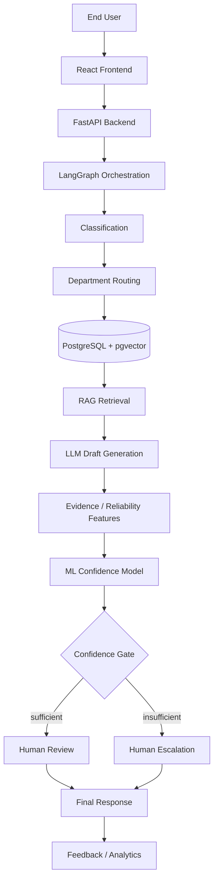

# TicketSense

**Multi-Agent Enterprise Ticket Routing & Resolution System**

TicketSense is an AI-assisted platform for routing and resolving enterprise support
tickets. A ticket (text, optionally with an attachment such as an image, PDF, or log) is
classified, routed to the right department, and matched against a department-scoped
knowledge base and prior resolved tickets. An LLM drafts a cited response from that
retrieved evidence, and an independent, separately trained confidence model — not the
LLM itself — decides whether the draft is reliable enough to hand to a human engineer
for review, or whether the ticket should be escalated untouched. TicketSense does not
send AI-generated responses to end users directly; a human engineer always makes the
final call.

> **Status: Week 2 (database schema, backend/frontend foundations).** The pipeline
> below describes the target architecture. See [Project status](#project-status) for
> what is actually implemented today.

```text
Ticket → Classification → Department Routing → Evidence Retrieval → Cited Draft
       → Independent ML Confidence Model → Confidence Gate
       → Human Review OR Human Escalation → Final Response → Feedback
```

## Why

Support teams already triage tickets manually against tribal knowledge and past
resolutions. Letting an LLM draft directly to the end user risks confident-sounding but
wrong answers, especially on out-of-distribution tickets. TicketSense's core idea is a
**confidence-gated human-in-the-loop workflow**: retrieval-grounded drafting, plus a
decision gate that a human — not the drafting model — trusts.

## Core contribution

TicketSense does not claim to invent retrieval-augmented generation, ticket
classification, or human-in-the-loop review — these are established techniques. Its
contribution is integrating them into a focused enterprise workflow where an
**independent ML confidence model acts as a decision gate** before any AI-assisted
resolution reaches a human reviewer. Critically, the LLM never rates its own confidence.
The confidence model instead consumes measurable, external signals about the specific
retrieval-and-draft that just happened:

- retrieval relevance
- ticket-to-resolution similarity
- knowledge-base document freshness
- OCR confidence (for tickets with an image/PDF attachment)
- category risk

That feature vector — not a model's self-assessment — determines whether a draft goes to
a human for review or the ticket is escalated directly. See
[docs/architecture.md](docs/architecture.md) for the full rationale and data flow.

## Example

A user submits:

> "Unable to generate a purchase order. Whenever I click Create PO, I receive SAP error
> ME023."

TicketSense classifies the ticket, routes it to SAP support, retrieves matching SAP
knowledge-base articles and previously resolved ME023 tickets, and drafts a cited
response. The confidence model scores the draft using the retrieval and similarity
signals above. If the score clears the threshold, the SAP engineer sees the draft for
review; if not, the ticket is escalated to the engineer directly, with the draft withheld.
The engineer's final action (accept/edit/reject/escalate) is logged as feedback.

## User roles

| Role | Capabilities (planned) |
|---|---|
| **End User** | Submit tickets with an optional attachment, view submitted tickets, track status |
| **Department Engineer** | View assigned tickets, review retrieved evidence and the AI draft, see confidence information, accept/edit/reject/escalate, send the final response |
| **Admin** | Manage users and departments, manage knowledge-base content, view system analytics, configure settings |

Role-based access, the review UI, and the escalation workflow are not built yet — see
[Project status](#project-status).

## Features

| Feature | Status |
|---|---|
| Repository, branch strategy, Docker Compose skeleton | ✅ Available |
| FastAPI backend skeleton (`/health`, router structure) | ✅ Available |
| Database schema + Alembic migrations (7 core tables) | ✅ Available |
| Vite + React + TypeScript frontend skeleton | ✅ Available |
| LangGraph orchestration pattern (design) | ✅ Documented, not implemented |
| ITSM UI pattern research + low-fidelity wireframes | ✅ Documented, not implemented |
| Public dataset identified + download script | ✅ Available (`data/download_dataset.py`) |
| RAG / calibration / human-AI deferral literature review | ✅ Documented |
| Knowledge-base article outline (5 departments) | ✅ Documented |
| Knowledge-base articles (SAP, Networking — 24 of 60) | ✅ Authored |
| Dataset cleaned and structured into project schema | ✅ Available (`data/clean_dataset.py`) — 2 of 5 departments have real examples, see [known limitations](docs/dataset-cleaning.md) |
| Train/val/test split strategy | ✅ Documented + implemented (`data/split_dataset.py`) |
| Ticket intake + optional attachment processing | ⏳ Planned |
| Ticket classification (department/priority/sentiment) | ⏳ Planned |
| Department routing | ⏳ Planned |
| Department-scoped RAG (knowledge base + resolved tickets) | ⏳ Planned |
| Evidence-grounded draft generation with citations | ⏳ Planned |
| Independent ML confidence model | ⏳ Planned |
| Confidence-based escalation | ⏳ Planned |
| Human-in-the-loop review (accept/edit/reject/escalate) | ⏳ Planned |
| Feedback logging | ⏳ Planned |
| Basic analytics | ⏳ Planned |
| Role-based access (3 roles) | ⏳ Planned |

## Architecture



Only the FastAPI backend, the Postgres+pgvector database (schema live via Alembic), and
the Docker Compose wiring between them exist today. The React frontend exists as an
unstyled Vite scaffold only (no screens built, no wiring to the backend yet). No API
endpoints read or write the database yet — the schema exists, but classification,
retrieval, drafting, and confidence scoring are still design targets described in
[docs/architecture.md](docs/architecture.md) and
[docs/langgraph-research.md](docs/langgraph-research.md).

## Project structure

```text
TicketSense/
├── backend/              FastAPI application
│   ├── app/                Application package
│   │   ├── models/           SQLAlchemy models (users, departments, tickets, ...)
│   │   ├── routers/          APIRouter modules (health so far)
│   │   ├── config.py, database.py, main.py
│   ├── tests/              Backend tests
│   ├── alembic.ini
│   ├── Dockerfile
│   └── pyproject.toml
├── db/
│   ├── migrations/        Alembic migration environment and versions
│   └── seed/knowledge_base/  Authored KB articles (SAP, Networking so far)
├── frontend/             Vite + React + TypeScript scaffold
│   ├── src/                Default Vite app entrypoint (not yet TicketSense screens)
│   └── package.json
├── data/                 Dataset download, cleaning, and split scripts
│   ├── download_dataset.py
│   ├── clean_dataset.py
│   └── split_dataset.py
├── docs/                 Architecture, research, and evaluation notes
├── docker-compose.yml    Postgres (pgvector) + FastAPI backend
├── .env.example          Environment variable template
├── .gitignore
├── .dockerignore
└── README.md
```

| Directory | Purpose |
|---|---|
| `backend/` | FastAPI service — models, routers, and config for the API |
| `db/migrations/` | Alembic migration environment (schema definitions live as SQLAlchemy models in `backend/app/models/`) |
| `db/seed/knowledge_base/` | Authored knowledge-base articles, one department per subfolder |
| `frontend/` | React UI — currently the default Vite scaffold, not yet the TicketSense screens |
| `data/` | Dataset download, cleaning, and train/val/test split scripts (raw/processed data itself is gitignored) |
| `docs/` | Architecture decisions, UI/LangGraph/dataset/literature research, wireframes, and the evaluation protocol |

`ai/` (embeddings/LangGraph/ML training) is planned for later weeks and is not present
yet.

## Setup

### Prerequisites

- [Git](https://git-scm.com/)
- [Docker Desktop](https://www.docker.com/products/docker-desktop/) (Compose v2)
- [Python 3.11+](https://www.python.org/) and [uv](https://docs.astral.sh/uv/) for local (non-Docker) backend development
- [Node.js 20+](https://nodejs.org/) for frontend development

### Clone

```bash
git clone <YOUR_REPOSITORY_URL>
cd TicketSense
```

### Environment

```bash
cp .env.example .env
```

Fill in local values as needed; defaults in `.env.example` work out of the box for local
development. Never commit `.env`.

### Run with Docker Compose

```bash
docker compose up --build
```

This starts:
- `db` — PostgreSQL with the `pgvector` extension, on `localhost:5432`
- `api` — the FastAPI backend, on `localhost:8000` (`/health` for a liveness check)

### Backend (without Docker)

```bash
cd backend
uv venv .venv
uv pip install -e ".[dev]"
.venv/Scripts/python -m uvicorn app.main:app --reload
```

### Run backend tests

```bash
cd backend
uv run pytest
```

### Database migrations

With `db` running (via Docker Compose or otherwise) and `DATABASE_URL` in `.env`
pointing at it:

```bash
cd backend
uv run alembic upgrade head
```

Applies the schema (`departments`, `users`, `tickets`, `knowledge_base`, `embeddings`,
`escalations`, `feedback`) via Alembic. `uv run alembic downgrade base` reverses it.

### Frontend

```bash
cd frontend
npm install
npm run dev
```

This runs the default Vite scaffold at `localhost:5173` — no TicketSense screens are
built yet (see [Project status](#project-status)).

### Dataset

```bash
pip install kagglehub
python data/download_dataset.py
```

Downloads the public ticket dataset identified for classification into
`data/raw/` (gitignored). See [docs/dataset-research.md](docs/dataset-research.md) for
what it is and why it was chosen.

```bash
pip install -r data/requirements.txt
python data/clean_dataset.py   # -> data/processed/tickets_clean.csv
python data/split_dataset.py   # -> data/processed/tickets_{train,val,test}.csv
```

Cleans the raw dataset into TicketSense's schema and splits it 70/15/15, stratified by
department. See [docs/dataset-cleaning.md](docs/dataset-cleaning.md) and
[docs/split-strategy.md](docs/split-strategy.md) — only 2 of 5 departments currently
have real examples, documented as a known limitation rather than papered over.

A seed/import-to-database script is not part of the repository yet.

## Environment variables

| Variable | Purpose |
|---|---|
| `POSTGRES_USER` | Postgres username (used by `docker-compose.yml`) |
| `POSTGRES_PASSWORD` | Postgres password |
| `POSTGRES_DB` | Postgres database name |
| `POSTGRES_PORT` | Host port mapped to Postgres (default `5432`) |
| `APP_ENV` | Backend environment name (`development`/`production`), returned by `/health` |
| `CORS_ORIGINS` | Comma-separated origins allowed to call the API |
| `DATABASE_URL` | Async SQLAlchemy connection string, used by the backend and Alembic (must stay in sync with the `POSTGRES_*` values) |

## Development workflow

1. Create an issue/task for the piece of work.
2. Create a feature branch off `main`.
3. Implement the change.
4. Test locally (and in Docker, if Docker config is affected).
5. Commit with a short, focused message.
6. Push the branch.
7. Open a PR for review/merge on GitHub.

Example branch names:

```text
feature/ticket-intake
feature/rag-retrieval
feature/confidence-model
```

## Project status

### Completed
- GitHub repository and branch strategy
- Docker Compose skeleton (`db` + `api`) — builds and runs locally
- Initial FastAPI project structure with a working `/health` endpoint, a base router
  structure (`app/routers/`), and a passing test
- Database schema live via Alembic — `departments`, `users`, `tickets`,
  `knowledge_base`, `embeddings` (pgvector), `escalations`, `feedback`; migration
  verified upgrade/downgrade/upgrade against a running Postgres container
- Vite + React + TypeScript frontend scaffold — installs and builds locally (default starter screen only)
- LangGraph orchestration pattern researched and documented ([docs/langgraph-research.md](docs/langgraph-research.md))
- ITSM ticket-submission and reviewer-dashboard UI patterns researched, with low-fidelity wireframes for all three roles ([docs/ui-research.md](docs/ui-research.md), [docs/wireframes.md](docs/wireframes.md))
- Public IT-support ticket dataset identified, verified, and downloadable locally ([docs/dataset-research.md](docs/dataset-research.md), `data/download_dataset.py`)
- Literature reviewed on RAG, confidence calibration, and human-AI deferral ([docs/literature-review.md](docs/literature-review.md))
- Knowledge-base article outline drafted across all five target departments ([docs/knowledge-base-outline.md](docs/knowledge-base-outline.md))
- First batch of knowledge-base articles authored — SAP and Networking, 12 each (`db/seed/knowledge_base/`)
- Public dataset cleaned and structured into the project's schema, and split 70/15/15 for classification ([docs/dataset-cleaning.md](docs/dataset-cleaning.md), [docs/split-strategy.md](docs/split-strategy.md)) — honestly limited to 2 of 5 departments given what the source dataset actually contains
- Architecture and evaluation protocol documented ([docs/architecture.md](docs/architecture.md), [docs/research-evaluation.md](docs/research-evaluation.md))

### In Progress
- React app shell and static ticket-submission form (Week 2, Aashritha) — not yet in this branch.

### Planned
- TicketSense frontend screens (End User, Department Engineer, Admin) built from the Week 1 wireframes
- Authoring the remaining knowledge-base articles (Cloud, Database, HR — 36 of 60)
- Synthetic SAP/Cloud/Database ticket examples, since the public dataset has none
- Ticket classification (department/priority/sentiment)
- Department-scoped RAG (knowledge-base and resolved-ticket retrieval)
- LLM draft generation with citations (`ai/agents` LLM provider interface)
- LangGraph pipeline implementation
- Independent ML confidence model and confidence gate
- Human-in-the-loop review UI and escalation workflow
- Feedback logging and analytics
- Role-based access for the three user roles

## Scope

**In scope for v1:** ticket intake, classification, routing, RAG, cited draft generation,
an independent confidence model, human review, escalation, feedback, basic analytics, and
three user roles (End User, Department Engineer, Admin).

**Out of scope for v1:** Kubernetes, cloud deployment, Celery, RabbitMQ, Redis,
multi-tenancy, voice intake, major-incident clustering, large ITSM integrations,
autonomous final replies, and other enterprise infrastructure not required to demonstrate
the core workflow. These exclusions are deliberate, to keep the capstone scope feasible
within the project timeline.

## Evaluation

Planned metrics (not yet measured — no model or pipeline exists to evaluate):

- **Classification:** accuracy, precision, recall, F1
- **Retrieval:** Recall@K, relevance
- **Confidence model:** precision, recall, F1, ROC-AUC, calibration
- **Human review:** acceptance rate, edit rate, rejection rate, escalation rate, AI-human agreement
- **System:** response latency

See [docs/research-evaluation.md](docs/research-evaluation.md) for the full evaluation
protocol.

## Team

| Member | Primary Responsibility |
|---|---|
| Rishikesh | Backend, system architecture, integration |
| Aashritha Reddy | Frontend, UI/UX, user workflows |
| Shivaganesh | AI/ML, RAG, confidence model, evaluation |

All members contribute to Git/GitHub, testing, documentation, integration, and the final
presentation.

## Academic positioning

TicketSense is a capstone prototype demonstrating AI-assisted ticket resolution,
evidence-grounded generation, independent confidence estimation, human-in-the-loop
decision making, and measurable evaluation. It is a research/learning prototype, not a
production system.

## Documentation

- [docs/architecture.md](docs/architecture.md) — data flow, schema rationale, and design decisions
- [docs/research-evaluation.md](docs/research-evaluation.md) — experiment matrix and evaluation protocol
- [docs/langgraph-research.md](docs/langgraph-research.md) — planned LangGraph orchestration pattern
- [docs/ui-research.md](docs/ui-research.md) — ITSM UI pattern research
- [docs/wireframes.md](docs/wireframes.md) — low-fidelity wireframes for all three roles
- [docs/dataset-research.md](docs/dataset-research.md) — public dataset identification, structure, and license
- [docs/literature-review.md](docs/literature-review.md) — RAG, confidence calibration, and human-AI deferral literature
- [docs/knowledge-base-outline.md](docs/knowledge-base-outline.md) — planned KB article outline across all five departments
- [docs/dataset-cleaning.md](docs/dataset-cleaning.md) — queue → department mapping and its limitations
- [docs/split-strategy.md](docs/split-strategy.md) — train/validation/test split strategy

## License

To be decided.
