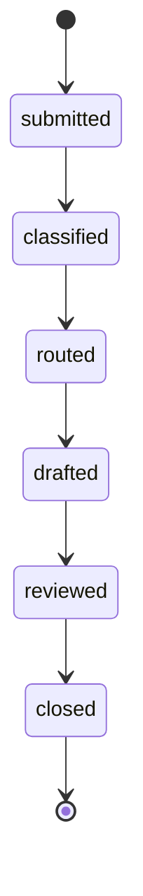

# Ticket lifecycle state machine

Week 3 note (Rishikesh) defining the ticket lifecycle referenced in
[architecture.md](architecture.md)'s data flow. Implemented in
`backend/app/services/ticket_lifecycle.py`; the `tickets.status` column and its
`ck_tickets_status` constraint were migrated to match (`db/migrations/versions/
0002_ticket_lifecycle_states.py`, replacing the placeholder states from the Week 2
schema).

## States

| State | Meaning | Set by (week implemented) |
|---|---|---|
| `submitted` | Ticket created by an End User | Week 3 (this week) — `POST /tickets` |
| `classified` | Department/priority/sentiment predicted | Not yet implemented — classification is later scope |
| `routed` | Assigned to a department/engineer | Not yet implemented |
| `drafted` | LLM has produced a cited draft | Not yet implemented |
| `reviewed` | Engineer has accepted/edited/rejected the draft | Not yet implemented |
| `closed` | Terminal — resolved and closed | Not yet implemented |

## Rules

- **Strictly linear, one step at a time.** `can_transition(current, target)` only
  returns `True` for the single next state in the chain above — no skipping ahead
  (`submitted` straight to `closed`) and no going backwards.
- **`closed` is terminal.** No transition out of `closed` is valid.
- **Escalation is not part of this chain yet.** The confidence-gate design in
  `architecture.md` describes an escalation path that bypasses human review of an AI
  draft; how that intersects with this linear state machine (a branch from `routed`? a
  parallel `escalated` state?) is an open design question for the week the confidence
  gate is actually built, not decided here. Deciding it now would be guessing ahead of
  the information a real confidence model will surface.

## What's wired up this week vs. not

Only `submitted` is reachable through the API right now — `POST /tickets` creates a
ticket in that state, and nothing currently advances it, because classification,
routing, drafting, and review aren't implemented yet (see README.md Project status).
The state machine module exists and is unit-tested
(`backend/tests/test_ticket_lifecycle.py`) so later weeks' endpoints can call
`transition()` rather than writing status strings directly and risking an invalid jump.
